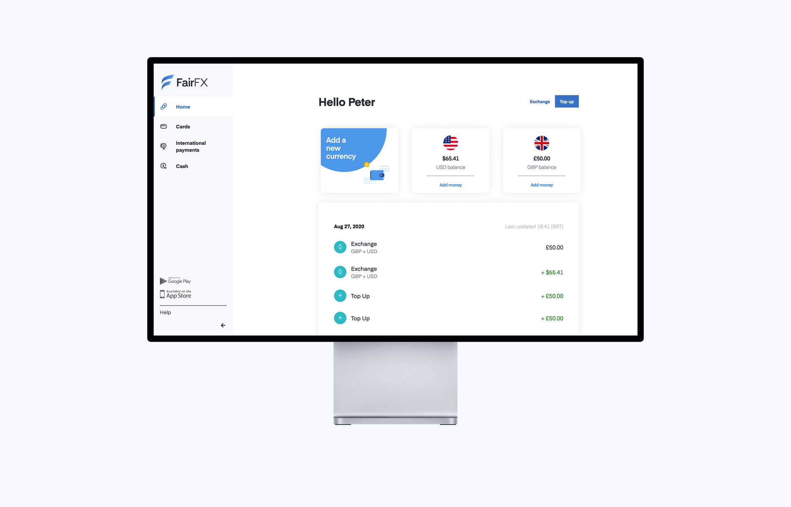
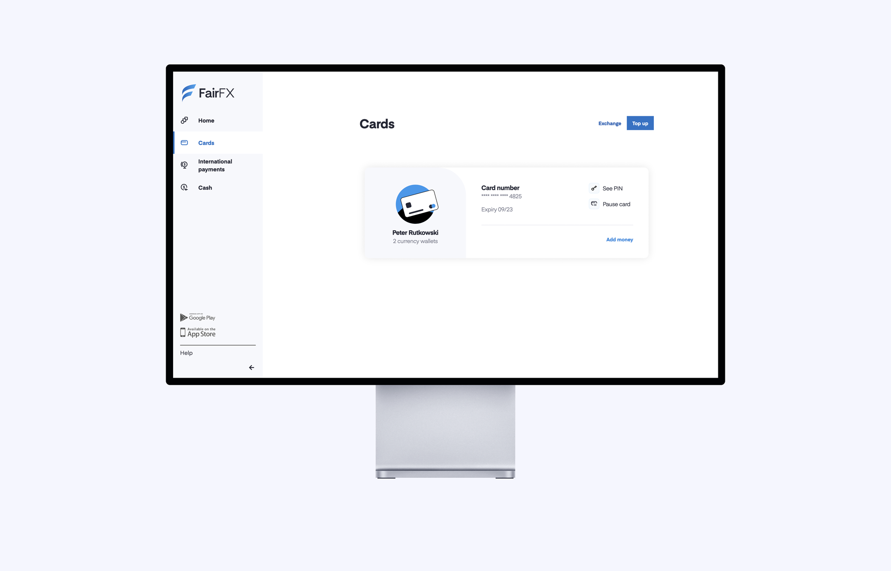

I have recently started a new job! And not only _a job_, it's a placement position as a software developer for an amazing fin-tech company based in the heart of London - [Equals](https://equals.co)!

For those not familiar with the brand, it's a financial company offering a range of products, from business targeted products like Equals Spend, to currency exchange, like the [FairFX](https://fairfx.com) brand, which is a subsidiary of Equals group. The FairFX currency card offers competetive rates and fee-free use of the card abroad in one of the 15 supported currencies - it is also the product to which I have dedicated the last month and a half of my time at Equals.

The new and improved FairFX brand is a result of much needed changes after the Wirecard scandal in June earlier this year. Now, I have not been with the company since all the way back then, but joined shortly after in the first half of July. By that time the design and engineering teams at Equals have already done an amazing job, with all new infrastracture, and the building stones for two brand new apps already laid out. The new apps had a fast approaching deadline, and a lot of work had to be done in order to deliver such a huge project in a short time.

Already from my first day with the company I had no easy task - I've dived right in to an unknown and completely new codebase, with unknown to me work- and dev-flows, and I had to adapt quick. I was put in the squad responsible for developing the web app where online banking lives, while the other part of my team was working on the mobile app, with our engineering lead jumping between the projects to help us as much as he could. In the first few days I've gotten enough time to go through much of the code and the internal infrastracture, and started opening my first pull requests the very same week. In addition to working on the web app  with my team, I have also contributed my bit to Geometry - the internal component library at Equals, allowing the teams quck access to reusable, custom designed components to use throughout the apps.

 
 

  

    
  

  

    
  

    

    
  

 
 

The past month and a half has been an amazing learning experience for me. I feel like I have achieved so much in such a short period of time, and I've got to experience what working in a real dev team looks like. Along the way I was never left alone, and have had amazing colleagues such as Tabi, [Mahedi](https://mahedi.co/) and my team lead [Jamie](https://halvorson.co.uk/) to always help me whenever I was stuck. With their help I was learning something new every day, have it been the simplest CSS-related tip, or an advanced method of achieving what I wanted with JavaScript.

Doing a placement has been one of my best decision so far regarding my education and career, and I am incredibly excited for what the next months at Equals bring me!
